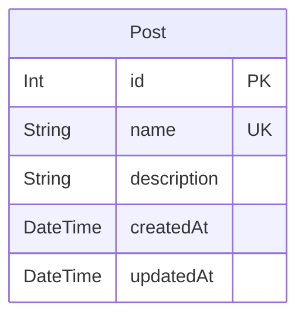

# Data Model Documentation — TCIT Posts Manager

This document describes the data model for the Posts Manager application, including entity descriptions, field definitions, validation rules, and the Prisma schema.

## Model Descriptions

### Post

Represents a content post created by users. This is the core and only entity in the current version of the application.

**Fields:**

| Field       | Type     | Constraints                          | DB Column     |
|------------|----------|--------------------------------------|---------------|
| id         | Int      | Primary Key, auto-increment          | id            |
| name       | String   | Required, unique, max 255 chars      | name          |
| description| String   | Required, max 2000 chars             | description   |
| createdAt  | DateTime | Auto-set on creation                 | created_at    |
| updatedAt  | DateTime | Auto-updated on modification         | updated_at    |

**Validation Rules:**
- `name` is required, must be unique, 1-255 characters
- `description` is required, 1-2000 characters
- `createdAt` is automatically set when the record is created
- `updatedAt` is automatically updated on any modification

**Indexes:**
- Primary key on `id`
- Unique constraint on `name`
- Index on `created_at` for ordering

## Prisma Schema

```prisma
// prisma/schema.prisma
generator client {
  provider = "prisma-client-js"
}

datasource db {
  provider = "postgresql"
  url      = env("DATABASE_URL")
}

model Post {
  id          Int      @id @default(autoincrement())
  name        String   @unique @db.VarChar(255)
  description String   @db.VarChar(2000)
  createdAt   DateTime @default(now()) @map("created_at")
  updatedAt   DateTime @updatedAt @map("updated_at")

  @@index([createdAt(sort: Desc)])
  @@map("posts")
}
```

## Entity-Relationship Diagram



## Key Design Principles

1. **Simplicity**: Single entity design matching the challenge requirements (CRUD for Posts)
2. **Referential Integrity**: Unique constraint on `name` prevents duplicates
3. **Audit Trail**: `createdAt` and `updatedAt` timestamps on all records
4. **Performance**: Index on `created_at` for efficient descending order queries
5. **Convention**: snake_case in database (PostgreSQL convention), camelCase in TypeScript (via Prisma mapping)

## Notes

- `id` uses auto-increment integers (suitable for this challenge scope)
- `name` has a unique constraint — the API returns a `CONFLICT` error if a duplicate name is submitted
- `description` is limited to 2000 characters (VarChar for PostgreSQL efficiency)
- All timestamps are stored in UTC
- The `@@map("posts")` directive maps the PascalCase model to a snake_case table name
